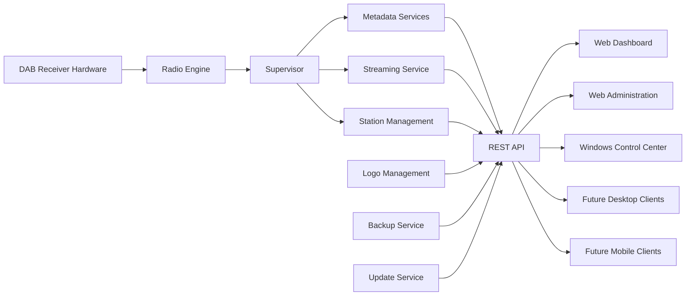
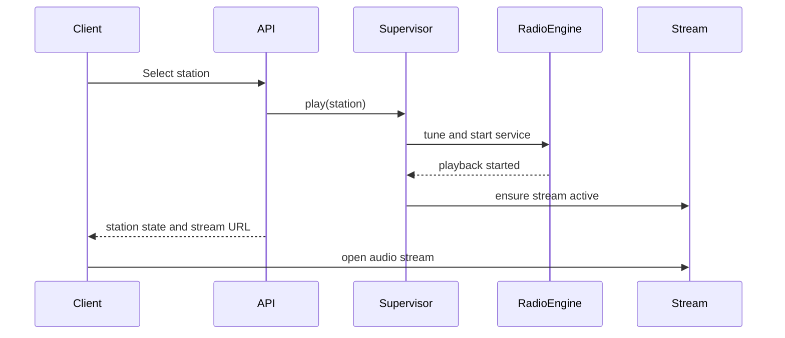
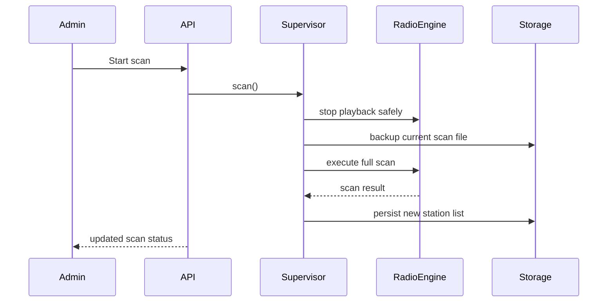
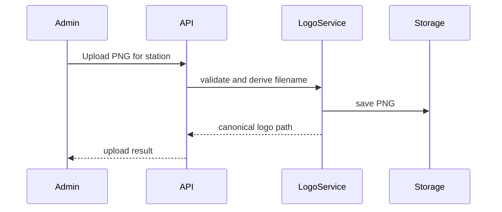

# DAB Control Suite Architecture

**Status:** Draft  
**Version:** 0.1.0-alpha  
**Project Founder & Lead Developer:** Michael Willner  
**License:** Mozilla Public License 2.0 (MPL-2.0)

## 1. Purpose

This document defines the target architecture of the DAB Control Suite.

The suite is designed as a modular, network-enabled DAB/DAB+ platform. A Raspberry Pi with a supported DAB receiver acts as the server. Desktop and future mobile clients communicate with the server through a documented REST API.

The architecture must remain understandable, maintainable, testable, and extensible.

## 2. Architectural Goals

- Keep radio hardware access isolated from user interfaces.
- Provide one stable REST API for all clients.
- Avoid duplicated business logic.
- Keep the server operable without a desktop client.
- Support future hardware backends.
- Support future Windows, Linux, macOS, Android, and iOS clients.
- Allow controlled updates, backups, and recovery.
- Keep deployment reproducible.

## 3. System Overview



## 4. Main Components

### 4.1 DAB Control Server

The DAB Control Server runs on Linux, initially targeting Raspberry Pi systems.

Responsibilities:

- Hardware access
- DAB/DAB+ scanning
- Station tuning
- Audio decoding
- Audio streaming
- Metadata extraction
- Station list management
- Dashboard selection
- Logo management
- Administration
- Backup and recovery
- Update orchestration
- REST API

The server is the authoritative source for radio state and configuration.

### 4.2 Radio Engine

The Radio Engine encapsulates all communication with the DAB receiver.

Responsibilities:

- Initialize hardware
- Tune frequencies
- Select services and components
- Start and stop decoding
- Expose signal data
- Produce stable runtime state
- Report recoverable and fatal errors

The Radio Engine must not contain web or desktop user-interface logic.

### 4.3 Supervisor

The Supervisor coordinates runtime services.

Responsibilities:

- Start and stop the Radio Engine
- Prevent conflicting operations
- Coordinate scans and playback
- Restart failed processes
- Maintain current station state
- Expose health information
- Perform controlled shutdown and recovery

The Supervisor is the single orchestration layer between hardware services and the API.

### 4.4 Metadata Services

Metadata Services parse and normalize broadcast metadata.

Responsibilities:

- DLS / Radiotext
- Ensemble information
- Signal quality
- Current programme information
- Song interpretation
- History data
- Cache freshness

Metadata must be exposed through a stable schema, even when individual values are temporarily unavailable.

### 4.5 Streaming Service

The Streaming Service publishes decoded audio to network clients.

Initial implementation:

- FFmpeg-based encoding
- Icecast streaming
- MP3 output

Future implementations may support additional codecs or protocols without changing client-facing API semantics.

### 4.6 Station Management

Station Management owns the full scanned station list.

Responsibilities:

- Parse scan results
- Preserve stable station identifiers
- Expose all discovered stations
- Maintain separate dashboard visibility state
- Avoid modifying raw scan data for UI preferences

The scan result and dashboard selection must remain separate.

### 4.7 Logo Management

Logo Management is the only source of truth for:

- Station logo slug generation
- Logo filename generation
- Logo storage paths
- Default logo behaviour
- Logo upload validation

Clients must never recreate logo filenames independently.

### 4.8 Web Dashboard

The Web Dashboard provides browser-based radio playback and status display.

Responsibilities:

- Display dashboard-enabled stations
- Start playback
- Show station logo
- Show Radiotext and signal values
- Provide basic power controls

The dashboard consumes the REST API and must not access hardware directly.

### 4.9 Web Administration

The Web Administration interface provides server management.

Responsibilities:

- Start DAB scans
- Display all discovered stations
- Enable or disable dashboard visibility
- Start temporary test playback
- Upload station logos
- Display scan and system logs
- Show service health
- Trigger backups and updates in future releases

### 4.10 DAB Control Center

The DAB Control Center is the native Windows desktop application.

Planned areas:

- Radio
- Administration
- History
- Favourites
- Settings
- Updates
- About

The application communicates only through the public REST API.

## 5. Data Flow

### 5.1 Playback Flow



### 5.2 Scan Flow



### 5.3 Logo Upload Flow



## 6. API Boundaries

The REST API is the only supported integration boundary for clients.

Planned API groups:

```text
/api/status
/api/stations
/api/history
/api/play/{index}
/api/stop
/api/power/on
/api/power/off
/api/stream

/api/admin/stations
/api/admin/scan/start
/api/admin/scan/status
/api/admin/dashboard/toggle
/api/admin/logos/upload
/api/admin/system/status
/api/admin/logs
/api/admin/backup
/api/admin/update
```

API rules:

- JSON responses must use stable schemas.
- Errors must include a machine-readable code and a human-readable message.
- Clients must not depend on filesystem paths.
- Backward compatibility must be maintained within a major version.
- Administrative endpoints require authentication before public release.

## 7. State and Persistence

Persistent data includes:

- Scan result
- Dashboard station selection
- Station logos
- Version information
- Update state
- Backup metadata
- Configuration

Runtime caches include:

- Current station
- Metadata
- Signal status
- Stream status
- Scan progress
- Service health

Persistent state must not be stored only in memory.

## 8. Security Model

Before public release, the following controls are required:

- Admin authentication
- Token or session-based authorization
- Restricted file uploads
- PNG signature validation
- Size limits
- Path traversal prevention
- Update package integrity verification
- SHA-256 checksums
- Optional release signatures
- No arbitrary shell command execution through the API
- Least-privilege service accounts where practical

## 9. Update Architecture

Updates are distributed through GitHub Releases.

Server update flow:

1. Query latest release metadata.
2. Compare semantic versions.
3. Download release package.
4. Verify checksum.
5. Create backup.
6. Stop affected services.
7. Install update.
8. Restart services.
9. Run health checks.
10. Roll back on failure.

Windows update flow:

1. Check GitHub Releases.
2. Compare installed version.
3. Download signed installer.
4. Verify integrity.
5. Launch installer.
6. Restart application.

## 10. Backup Architecture

Backups should include:

- Station scan data
- Dashboard selection
- Logos
- Configuration
- Version metadata
- Selected logs
- Future user settings

Backups must be restorable independently from source-code deployment.

## 11. Extensibility

Future hardware adapters may implement a common interface:

```text
RadioBackend
├── initialize()
├── scan()
├── tune()
├── play()
├── stop()
├── status()
└── shutdown()
```

Initial backend:

- uGreen / Si468x-based DAB receiver

Possible future backends:

- RTL-SDR
- USB DAB receivers
- Network receivers
- Mock backend for testing

## 12. Repository Structure

```text
DAB-Control-Suite/
├── server/
│   ├── app.py
│   ├── config.py
│   ├── services/
│   ├── workers/
│   ├── templates/
│   ├── static/
│   ├── tests/
│   └── requirements.txt
├── desktop/
│   └── windows/
├── installers/
│   ├── raspberry-pi/
│   └── windows/
├── docs/
├── api/
├── hardware/
├── screenshots/
├── .github/
├── README.md
├── LICENSE
├── CHANGELOG.md
├── CONTRIBUTING.md
└── ARCHITECTURE.md
```

## 13. Engineering Rules

- Analyse before modifying.
- Verify instead of guessing.
- Change only affected files.
- Keep one source of truth.
- Preserve backward compatibility.
- Document architectural decisions.
- Test syntax, logic, and runtime behaviour.
- Do not mark work complete without verification.
- Do not claim tests that were not performed.

## 14. Versioning

The project uses Semantic Versioning.

Examples:

```text
0.1.0-alpha
0.2.0-alpha
0.5.0-beta
1.0.0
```

The API version and application versions may evolve independently, but compatibility must be documented.

## 15. Current Milestones

### Milestone 1 — Repository Foundation

- Architecture
- Development workflow
- Licensing
- Contribution guidelines
- Initial roadmap

### Milestone 2 — Raspberry Pi Installer

- Dependency installation
- Service deployment
- Configuration wizard
- Health checks
- Uninstall and repair modes

### Milestone 3 — Windows Control Center

- Server discovery
- Playback
- Administration
- Logo management
- Logs
- Settings

### Milestone 4 — Update System

- GitHub Releases
- Integrity checks
- Backup
- Rollback
- Client update notifications

### Milestone 5 — Stable Release

- Documentation complete
- Installer tested on clean systems
- API stabilized
- Security review
- Version 1.0.0
